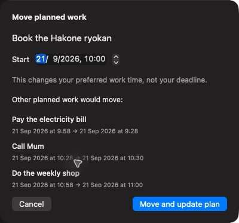

# Work companion

Implemented 18 September 2026 following the [Up next design review](ux-research/2026-09-18/up-next-rethink.md).

The global suggestion banner is replaced by a stable Work toolbar control. Opening it shows a task's planned slot, estimate, scheduling source, and separate deadline. Suggestions never open the panel or begin recording automatically. While recording, a labeled Stop button remains in the toolbar across destinations.

## Behavior

- Start now/Start working and Resume explicitly create a work segment. Stop saves it and leaves the task open; the resumable occurrence persists across relaunches.
- Later can quiet the occurrence for 15 minutes, with Undo, without changing its plan. Move planned time separately previews changes to other tasks before saving a preferred placement.
- Choosing a different task while recording requires a switch confirmation. The prior segment must save before a new one starts.
- The first extension that would displace another task pauses recording for consent. Its preview lists old/new times and is recomputed when accepted; changed impact requires another review. Waiting for approval is not recorded. Availability, pins, and fixed busy time still bound work.
- Completing reports the finished occurrence, recorded time, and next recurrence when applicable. Undo restores the occurrence without restarting time.
- Task-local actions, the Work menu, and the command palette share the same occurrence validation and switching rules. Stale recurrence references cannot start a replacement occurrence.
- Background Work notifications are opt-in. Start reminders are coalesced by occurrence and snooze revision; reviewing an extension opens its impact preview.

## Verification

Native review used a separately signed `Openlist Work Review.app` with its own bundle identifier, preferences, and seeded sample library. CloudKit and real notifications were disabled for that review. No personal task library was used.

Native checks covered opening a future suggestion; snooze feedback and Undo; Start, Stop, Resume; persistent Stop after navigating from Today to Inbox; task selection and switch confirmation; recurring completion and Undo; stopped-session recovery after relaunch; Escape dismissal; command-palette search and Return to open Work; and editing, canceling, and saving a Move preview. The saved preferred time and unchanged deadline were verified in the reopened panel. Accessibility-tree inspection confirmed named controls and recording status. Native review found and prompted fixes for a spurious stale-occurrence warning after completion and an incorrect unavailable-slot label for tasks moved earlier.

The runtime suite exercises occurrence safety, persistence, switching, consent at the first displaced-task boundary, stale impact review, actual recorded intervals, hard boundaries, and failure recovery. Added regression cases cover the Work companion and Move previews.

Build and full-suite results are recorded with the implementation commit's handoff. The development build also verifies the app/widget/helper identity and isolated storage entitlements.

## Remaining validation limits

Full spoken VoiceOver, enlarged text, both native appearances, compact-window resizing, and physical sleep/lock transitions were not exhaustively exercised in this pass. Runtime checks cover interruption and boundary logic; the earlier browser mockup's responsive and appearance checks are not native evidence. Real notification delivery was deliberately disabled in the sample app. The proposed human comparison study remains a product-research follow-up, not a completed study.

## Integration

This change is intended to combine with the parallel Inbox redesign. Resolve overlaps in RootView, AppCommands, README, and runtime source lists while keeping the Work toolbar and removing the old CalendarWorkBanner. No schema migration or external dependency is introduced.
