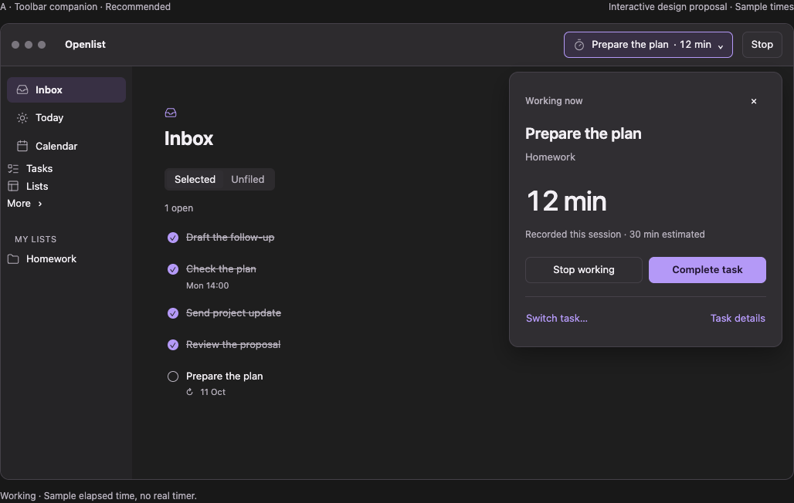

# Rethinking “Up next”

Design research and proposal · 18 September 2026 · No application changes

This document preserves the research stage. The user subsequently authorized direction A; see [the implementation and verification record](../../WORK_COMPANION.md) for the resulting native changes.

**Recommendation: replace the global suggestion banner with a stable Work control in the toolbar.** Before work starts, it opens a suggestion with its planned time, duration, and reason. During work, it becomes a compact session control with an always-visible Stop action. Keep planned time, recorded time, and task completion distinct throughout the journey.

The objective is to help someone choose and carry out their next piece of work without making every screen feel like a timer prompt. This is a proposed direction, not a usability-tested result or an implementation specification approved by the user.

## Evidence: Openlist today

Reviewed checkout: `/Users/ali/.codex/worktrees/ab9c/openlist`, commit `6e6c0baa46f9a51cc5dec0ae202ca4ac88037986`. Used read-only by this task. [Frozen source excerpts](source-evidence.md) preserve the baseline; live file anchors may move as other work continues. The supplied [original Inbox screenshot](/Users/ali/.codex/worktrees/ab9c/openlist/docs/ux-feedback/2026-09-18/inbox-original.png) was inspected. No native app was launched, no private task database was queried, and no real timer was started. Runtime descriptions below are source-derived rather than newly tested native behavior.

| Observed behavior | Evidence | Consequence for the redesign |
| --- | --- | --- |
| The banner sits above routed content, including Inbox, Today, Calendar, and other destinations. | [RootView.swift:382](/Users/ali/.codex/worktrees/ab9c/openlist/openlist/Views/RootView.swift:382) | A suggestion currently takes global prominence irrespective of the user's current intent. |
| “Up next” selects the first non-active planned block whose start is already at or before now, with a matching incomplete occurrence. It is not a preview of the next future task. | [CalendarCoordinator.swift:559](/Users/ali/.codex/worktrees/ab9c/openlist/openlist/Services/CalendarCoordinator.swift:559) | Use “Ready when you are” for available-now work; reserve “Planned for 14:00” for future work. |
| The 54-point strip shows title, “Your time starts when you do,” and Start. It omits planned time, duration, source of the suggestion, and a decline action. | [CalendarWorkBanner.swift:65](/Users/ali/.codex/worktrees/ab9c/openlist/openlist/Views/CalendarWorkBanner.swift:65) | A person cannot assess why this task is being suggested or explicitly quiet the prompt. |
| Planning intent and due date are separate. Candidate tasks can enter planning through Today selection, deferral, placement, an active session, or a deadline within the horizon. | [TaskSchedulingSection.swift:23](/Users/ali/.codex/worktrees/ab9c/openlist/openlist/Views/TaskSchedulingSection.swift:23), [AdaptiveScheduler.swift:116](/Users/ali/.codex/worktrees/ab9c/openlist/openlist/Services/AdaptiveScheduler.swift:116) | Do not imply the user personally chose today's slot. Explain “Automatically planned” versus “You chose this time.” |
| Work that misses its start by five minutes is rescheduled. A rescheduling summary is displayed only on Calendar. | [CalendarCoordinator.swift:572](/Users/ali/.codex/worktrees/ab9c/openlist/openlist/Services/CalendarCoordinator.swift:572), [CalendarWorkBanner.swift:84](/Users/ali/.codex/worktrees/ab9c/openlist/openlist/Views/CalendarWorkBanner.swift:84) | A suggestion can change while the person stays in Inbox, without showing the reason there. |
| Starting is explicit, checks availability/fixed busy time, saves a session, and pauses any different current task first. Start also exists in calendar context menus, smart-task context menus, and task scheduling details. | [CalendarCoordinator.swift:183](/Users/ali/.codex/worktrees/ab9c/openlist/openlist/Services/CalendarCoordinator.swift:183), [CalendarTaskBlock.swift:100](/Users/ali/.codex/worktrees/ab9c/openlist/openlist/Views/CalendarTaskBlock.swift:100), [SmartTaskRow.swift:129](/Users/ali/.codex/worktrees/ab9c/openlist/openlist/Views/SmartTaskRow.swift:129), [TaskSchedulingSection.swift:87](/Users/ali/.codex/worktrees/ab9c/openlist/openlist/Views/TaskSchedulingSection.swift:87) | Preserve task-local entry points. Do not automatically begin tracking because a planned start arrives. |
| Running state shows elapsed session minutes, Pause, and Done. Pause closes the work record without completing the task. Manual Pause does not itself populate `resumeTaskID`. | [CalendarWorkBanner.swift:30](/Users/ali/.codex/worktrees/ab9c/openlist/openlist/Views/CalendarWorkBanner.swift:30), [CalendarCoordinator.swift:224](/Users/ali/.codex/worktrees/ab9c/openlist/openlist/Services/CalendarCoordinator.swift:224) | A consistent stopped-session summary and Resume affordance would be a new product behavior. |
| Lock/sleep normally pauses recording; a per-task “Track work away from this Mac” setting changes that behavior. Fixed busy time and available hours still bound sessions. Relaunch recovers at the last heartbeat. | [CalendarCoordinator.swift:76](/Users/ali/.codex/worktrees/ab9c/openlist/openlist/Services/CalendarCoordinator.swift:76), [CalendarCoordinator.swift:341](/Users/ali/.codex/worktrees/ab9c/openlist/openlist/Services/CalendarCoordinator.swift:341), [TaskSchedulingSection.swift:60](/Users/ali/.codex/worktrees/ab9c/openlist/openlist/Views/TaskSchedulingSection.swift:60) | Every paused state needs a reason and a truthful recording status. |
| Two minutes before the estimate ends, a heads-up can appear. The first extension can move flexible tasks automatically. After an automatic extension has been used, further extensions that displace tasks require confirmation and pause recording. | [CalendarCoordinator.swift:433](/Users/ali/.codex/worktrees/ab9c/openlist/openlist/Services/CalendarCoordinator.swift:433) | The confirmation must explicitly say “Time stopped.” Current banner copy says only “More time would move other tasks.” |
| Completion closes matching open work records and completes the occurrence; recurring tasks may immediately advance to a new occurrence. | [Store+Tasks.swift:26](/Users/ali/.codex/worktrees/ab9c/openlist/openlist/Services/Store+Tasks.swift:26), [Store+Calendar.swift:199](/Users/ali/.codex/worktrees/ab9c/openlist/openlist/Services/Store+Calendar.swift:199) | “Complete task” is different from “Stop working.” Recurrence feedback must identify the completed occurrence. |
| System start/overrun notifications are delivered when Openlist is inactive, subject to permission and nudge deduplication. Their actions can start or complete work. | [CalendarNotificationBridge.swift:43](/Users/ali/.codex/worktrees/ab9c/openlist/openlist/Services/CalendarNotificationBridge.swift:43) | App prominence and system notifications need one coherent interruption policy. |

The screenshot shows “Prepare the plan” both in the banner and in Inbox with a recurring/date marker. It does **not** establish why this particular task was selected, its actual duration, or its next recurrence. All proposed times, durations, and subsequent tasks in the visual are illustrative.

## Evidence: Mobbin references

Both `search_screens` and `search_flows` were used. Returned previews were visually inspected; the four retained images below were downloaded from their high-resolution `image_url` values and inspected again. These are observed UI patterns, not evidence that the products' complete runtime behavior or user outcomes match Openlist.

| Reference | What the inspected image/sequence shows | What to borrow; what not to infer |
| --- | --- | --- |
| [Asana: starting a timer, three-screen flow](https://mobbin.com/flows/3d2a26a3-522b-4186-8b2d-64d1735f9625). [Active screen](https://mobbin.com/screens/d291d24c-dc7b-4b87-874b-5f6cb1907158). | Start timer is inside task details; active time appears there plus a compact bottom-right task/timer strip. Final preview shows recorded time and a confirmation message. | Borrow continuity from task-local start to persistent session status. The screenshots do not prove keyboard behavior or interruption handling. |
| [Amie: starting a timer, five-screen flow](https://mobbin.com/flows/724e92b9-840d-454f-88d0-d2199dde104d). [Duration selection](https://mobbin.com/screens/0425c4c2-a329-4a49-910d-751409f30258), [active screen](https://mobbin.com/screens/a80e3082-0d91-406c-84c8-eb3ca3d0b6d5). | A task card places duration and play together, beside the calendar. Later frames show a compact task row and a timer block at the current calendar time. | Borrow duration context beside Start, and the connection between a task and its calendar block. Do not borrow a calendar-only dependency for controlling active work. |
| [Toggl Track: focus timer](https://mobbin.com/screens/717d582d-454b-4902-a846-8545fe06fe9c). | A large elapsed timer, task/project labels, a stop control, and a close control fill a dedicated focus surface. | Supports considering an explicit focus destination. The image does not establish what Close does to tracking; Openlist should specify that independently. |

Local reference images: [Asana active](references/asana-active.webp), [Amie duration](references/amie-start.webp), [Amie active](references/amie-active.webp), [Toggl focus](references/toggl-focus.webp).

Other searches were reviewed but not used as primary evidence: a [Trello focus-time popover](https://mobbin.com/screens/d32d0804-04b4-4c1a-8ea2-717ff2beeae8) is more about scheduling; a [Charma schedule](https://mobbin.com/screens/3934bc00-0907-44de-a3d6-fe2e0a8c8d80) is not a work-session control; a [Google AI Studio example](https://mobbin.com/screens/114287b9-3302-4ad7-9daf-2159ffa0fb31) depicts an app preview, not a verified planner product journey. A Sunsama-targeted search returned a [ClickUp My tasks flow](https://mobbin.com/flows/a84f7f72-731f-415a-89a9-72daa6c84fea); no Sunsama evidence is claimed. A [second Toggl result](https://mobbin.com/screens/0377b3b9-d025-4acc-a063-dec579f16cc4) shows time-entry/calendar editing rather than the requested active control.

## Three complete alternatives

| Alternative | Plan → start | Working → stop/complete | Prominence and interruption | Tradeoff |
| --- | --- | --- | --- | --- |
| **A. Toolbar companion — recommended** | A stable Work button becomes “Work · Ready.” Open it to see one available task, planned slot, duration, reason, Start working, Later, and Choose another task. Existing task-local starts remain. | Start turns the toolbar control into task + elapsed minutes, with Stop beside it. Details contain Stop working and Complete task. A stopped summary offers Resume and clearly says the task is still open. | No content displacement; no unsolicited panel opening. Active and paused states are available from every route. | Adds one click from a passive suggestion. Discoverability must be tested; use a labeled control and one contextual introduction when planning is first used. |
| **B. Today card + session dock** | A compact “Ready when you are” card lives inside Today, alongside the day's plan. Start is immediately visible there. Other routes provide a quiet Work link back to Today. | Starting exposes a persistent bottom dock with task, elapsed time, Stop, and Complete. Stopping returns to the Today card with recorded time and Resume. | Passive suggestions are confined to planning; only active sessions occupy global space. | Two locations to learn. The bottom already hosts selection actions in Openlist; competing controls would need careful layout. Less discoverable to an Inbox-first user. |
| **C. Dedicated Work space** | A new Work destination shows the chosen task, next planned choices, and session context. User deliberately enters, chooses, and starts. | Large elapsed time and explicit Stop working / Complete task. Leaving Work keeps the timer active and exposes a compact toolbar status; stopping yields a session summary in Work. | Strongest separation of planning and doing. Focus mode is always optional. | Adds a destination and a mode to a lightweight task app. Most suitable if sustained focus becomes a central product purpose; too large a default for the issue observed. |

All three preserve explicit starts, show plan context, distinguish stopping from completing, and present schedule-impact decisions before moving someone else's planned work. The interactive proposal includes all three layouts through the design-alternative control.

## Recommended journey and state contract

**Language:** Work is the stable entry point. “Ready when you are” means startable now; “Planned for 14:00” means future work. “Working” means time is being recorded. “Paused” or “Stopped” means it is not. “Complete task” finishes the task or recurring occurrence. Avoid the ambiguous standalone “Done.”

| State / event | Visible treatment | Actions and outcome |
| --- | --- | --- |
| No plan / no current suggestion | Neutral Work toolbar item; empty panel offers Choose a task and Open calendar. | No setup gate or implied obligation to use a timer. Existing manual task starts remain available. |
| Future planned block | Neutral Work item; panel shows planned day, time, duration, and source. | Start now only when current availability permits. Moving the slot is distinct from changing the deadline. |
| Planned start arrives | Work · Ready, with a clock icon. Panel remains closed unless user opens it. | Start working, Later…, Choose another task, View plan. No focus steal or automatic tracking. |
| Start request | Brief “Starting…” state prevents repeated activation. | Show Working only after the session save succeeds. If blocked by availability, explain the next available slot. If save fails, preserve the task and offer Retry; never show a running clock. |
| Working | Task title + elapsed minutes in the toolbar; adjacent Stop available without opening anything. Panel shows “12 min recorded this session · 30 min estimated.” | Stop working saves this session and leaves the task open. Complete task saves and completes the occurrence. Clicking the task opens its context. Do not replace elapsed time with a countdown to a guessed finish. |
| User stops | Persistent quiet “Work · Paused”; panel says “12 minutes recorded. Task still open.” | Resume creates a new segment at the actual click time. Dismiss hides the prompt but retains the history and ordinary task-start paths. Never resume automatically. |
| Mac lock / sleep / relaunch | Paused status plus a specific reason and recorded total. | Resume explicitly after revalidating availability. If “Track work away” is enabled, accurately show continued tracking instead of falsely claiming the session paused. |
| Estimate nearly used / passed | A quiet line inside details: “Estimate reached; still recording.” Toolbar continues to identify a running session. | Continue while no other promised task must move and no hard boundary is crossed. No flashing, countdown anxiety, or modal. |
| Continuing would displace work | Persistent toolbar status “Work · Paused”; details say when recording stopped and show affected tasks with old/new times. | Continue 15 min, Keep paused, Complete task. Recompute impact at acceptance if time or calendar changed; stale impact must not be silently accepted. Fixed busy time cannot be overridden here. |
| Hard boundary reached | “Paused at 15:00 for fixed busy time.” Show next available slot. | View plan and Complete task. Resume is unavailable until the boundary permits it; show why rather than a dead button. |
| Task completed | “Occurrence complete · 12 minutes saved.” A repeating task also shows its next occurrence. | Undo completion and Choose next task. No automatic next start. Undo restores the occurrence/completion state while tracking remains stopped. |
| Different task selected while running | Small task-specific confirmation: “Save 12 min on A, then start B?” | Switch task or Cancel. Saving/stopping A must succeed before B starts. |
| Task deleted, archived, completed elsewhere, or occurrence changed | Remove stale start/resume actions; explain any stopped session once. | Refresh to current valid work. Never apply an action to a replacement recurrence by title alone. |

**Later has two meanings that must stay separate.** “Remind in 15 minutes” quiets this task's suggestion for 15 minutes without changing its deadline or manually moving its plan; normal replanning may still occur, and the next shown suggestion uses the current plan. “Move planned time…” changes the calendar placement, with a preview if other tasks are affected. Suppression must follow task occurrence rather than the changing slot so the same task cannot immediately re-prompt after a replan. These are proposed semantics, not existing capabilities.

**Missed starts:** preserve the current five-minute rescheduling policy initially, but make the updated slot and reason visible inside Work. Do not reopen the panel, repeatedly announce the same task, or produce a new attention cue every five minutes. If the panel is open, keep focus anchored to the same task and mark “Plan updated”; never swap a Start button's target underneath the pointer or keyboard focus.

**Recommended policy change:** request consent before the **first** extension that moves other promised work, not just later extensions. The existing code permits an initial automatic displacement. This is deliberately a behavioral recommendation, separate from the placement of the controls, and needs a product decision before implementation. If retaining the existing policy, the UI must disclose the automatic move and provide a review path from Work on every route.

## Before / after design review

| Before | After | Why |
| --- | --- | --- |
| Full-width accent strip for an unaccepted suggestion | Neutral, labeled toolbar entry; accent reserved for the running state and primary action | Visual prominence reflects the user's commitment. |
| “Up next” without time or provenance | “Ready when you are,” plus planned time, estimate, and source | Explains what is ready and why. |
| Start only | Start working, Later…, Choose another task | Gives an explicit way to reject or postpone a suggestion. |
| Pause / Done | Stop working / Complete task | Separates recording from task lifecycle. |
| “More time would move other tasks” while the clock has already paused | “Time stopped at 14:30” plus affected tasks and proposed new times | Makes the recording state and consequences visible. |
| Resume shown for some interruptions but not ordinary manual stopping | One consistent stopped-session summary | Makes returning to work predictable. |

## Keyboard, accessibility, and restraint

- Keep the existing Cmd-K command palette entry point. Propose named actions: Show work, Start selected task, Stop current session, Resume task, Complete current task. This review found no Start/Pause commands in the current palette view; these entries are proposed. Preserve Cmd-D for selected-task completion and Cmd-Return for task details; do not silently retarget them to a background active task.
- Tab follows native control order. Space/Return activates the focused button. Opening details never implicitly starts work. Escape dismisses details and returns focus to Work without stopping a session. Avoid assigning an unmodified Space shortcut because it conflicts with editing and controls. A dedicated global start/stop shortcut is deferred until a shortcut audit and usability test.
- Use native popover semantics in the eventual macOS implementation. Provide a stable VoiceOver label such as “Working on Prepare the plan, 12 minutes recorded, show work details.” Announce start, stop, failure, and boundary changes once; never announce every timer tick. Keep a visible Stop label instead of an icon-only square.
- Pair color with text and state icons. Use system-scaled text, full titles in details, sufficient contrast in both appearances, and layouts that survive long task names and enlarged text. Put date, duration, and source in the reading order before Start. Increase Contrast and Reduce Transparency need native verification.
- Keep passive changes motionless. Keyboard actions are immediate. A short pointer-triggered popover transition may explain its origin; honor Reduce Motion. No pulsing running dot or celebratory confetti. These choices apply the local design-engineering guidance to a frequently used work control.
- At compact widths, retain Work + state and Stop, shorten the task title, and wrap panel actions. Do not remove Stop, move it into overflow, or squeeze the title and actions into one line. The proposal reflows down to 320px for review; this is not a claim that the native app supports a 320px window.
- While Openlist is foregrounded, a passive suggestion must not open a panel or modal. Inactive-app start notifications should be opt-in and coalesced per occurrence, with Start, Later, and Open plan. Paused-recording notifications deserve higher priority than suggestions, but still must respect system permission and Focus settings. This unifies the existing background bridge with the proposed quiet foreground behavior.

## Validation before committing to a direction

Run brief comparison sessions with both people who time-block and people who mainly use Inbox. Show A, B, and C in varied order. Ask them to process Inbox, discover planned work, explain why it appears, start a session, stop without completing, resume, finish a recurring occurrence, and handle a displaced-task decision. Measure correct first action, confusion about whether the timer is running, accidental completions, and ability to return to the original task. Favor A only if its quieter suggestion remains discoverable.

Acceptance questions: Can someone identify the planned slot versus the deadline? Find Stop from every route? Tell when recording stopped? Decline a suggestion without deleting/deferring the task? Understand what will move before Continue? Use every action by keyboard and VoiceOver? Can they finish an occurrence without inadvertently starting the next one?

## Deliverables and limits

The inline visual is an interactive design simulation with illustrative content, fixed sample elapsed time, and no app connections. It initially opens the panel so the proposal can be reviewed; the proposed real app would keep it closed until requested. The host's design-alternative/state controls expose passive, active, stopped, interrupted, overrun, boundary, complete, empty, and failure treatments. Ordinary clicks cover Start, Stop, Resume, Complete, Later, task choice, and navigation. It is not a full scheduling simulator, a replacement native implementation, or a tested native accessibility result.

Browser validation passed for Start, Stop, Resume, completion, undo, switching in both directions with confirmation, Later, moving to the sample slot, Escape with focus restoration, and Enter to reopen. Geometry checks covered three concepts, nine states, light/dark appearance, and review surfaces of approximately 1028, 736, and 320 pixels; no panel/button escaped the horizontal bounds. Representative screenshots were visually inspected. This does not establish VoiceOver behavior, native popover behavior, actual scheduling correctness, or user comprehension.

Review images: [A ready, dark](../../../output/playwright/up-next/a-ready-dark.png), [A ready, light](../../../output/playwright/up-next/a-ready-light.png), [A working](../../../output/playwright/up-next/a-active-dark.png), [A schedule conflict](../../../output/playwright/up-next/a-overrun-dark.png), [B Today card](../../../output/playwright/up-next/b-today-dark.png), [C Work space](../../../output/playwright/up-next/c-focus-dark.png), [compact conflict](../../../output/playwright/up-next/narrow-overrun.png).

Only this research document, source reference images, and proposal/QA artifacts were created. This task did not change app source, app data, real sessions, or the reviewed checkout. Other Inbox feedback is out of scope.
