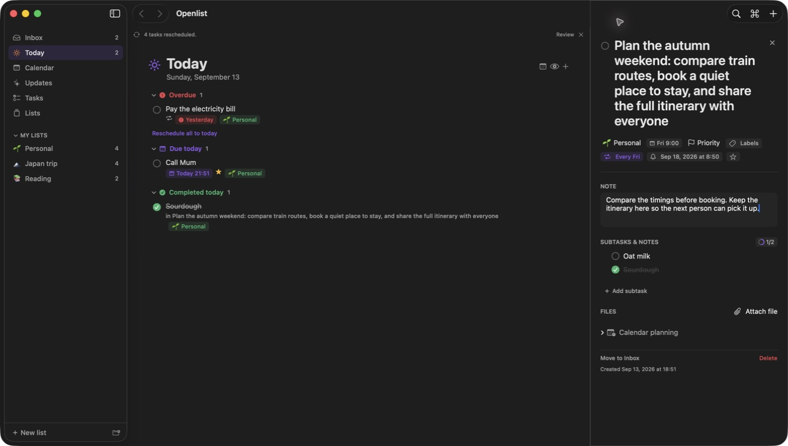
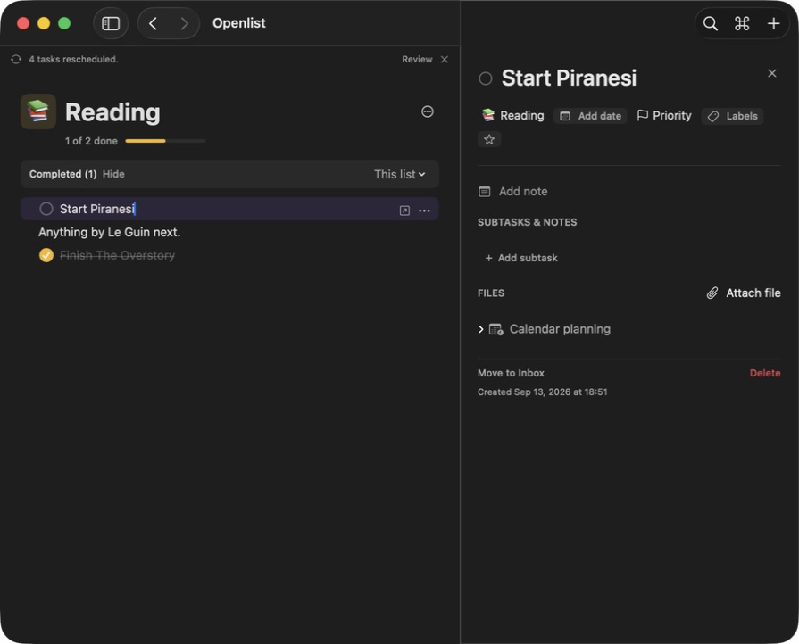

# BRI-52 task UI polish

Implementation and review evidence for [BRI-52](https://linear.app/brickd/issue/BRI-52/polish-task-ui-scheduling-controls-and-page-transitions), September 13, 2026. Host: macOS 26.6.2 (25G83), Xcode 27.0 (27A266a).

## Isolation

Built with `./Tools/build-dev.sh`: `Openlist Dev.app`, bundle ID `solimanali.openlist.dev`, separate local storage/preferences and no production CloudKit access. The normal Dev bundle passed its verifier and all nine development isolation checks. Native testing uses a separately signed copy with `OpenlistReviewSession=bri52-polish`, seeded with disposable sample tasks. Neither production data nor normal Dev tasks are fixtures.

## Acceptance criteria

| Area | Result and evidence |
| --- | --- |
| Calendar readability | Width-filling seven-column date grid, 14pt numbers, 34pt-high date targets, explicit selected/today states, preferred week start, month browsing, and arrow-key focus. Native calendar visually inspected; final keyboard pass pending. |
| Task title | 25pt semibold, editable, unrestricted multiline height. A 117-character title was entered and saved; see wide inspector screenshot. |
| Content before configuration | Notes, subtasks and attachments precede Calendar planning, collapsed on opening each task. Existing planning controls remain inside. Native order and collapsed state verified. |
| Compact metadata | List, date, priority, labels, active reminder/repeat and star wrap in one strip. Date/reminder/repeat chips opened the correct shared editor. Priority/label interaction pass pending. |
| Panel separation | 380pt preferred inspector, 300pt minimum, separate semantic surface and leading boundary, consistent 20pt padding. Wide and narrow native screenshots show readable document and inspector. |
| Row metadata | Due/list information stays below the title on smart rows at all widths; outline rows retain their existing metadata placement. Wide native Today and narrow list layouts inspected. |
| Quiet actions | The detail button remains in the accessibility/keyboard tree; hover, editing, selection, button focus or VoiceOver reveals the icon. Native AX exposes idle actions; editing reveals them, and Cmd-Return opens details. Full Tab pass pending. |
| Empty completed UI | Empty lists show a compact Completed menu. Its app-default/show/hide settings still work. Native test selected Hide while empty, completed a task, then used Show in the populated bar. |
| Unified scheduling | One popover contains Date & time, Reminder and Repeat sections. Natural-language date input, due-time edits, relative/custom reminders and recurrence settings use existing store methods. Native date/reminder/repeat edits persist; untouched browsing and Escape left an unscheduled task unchanged. Relaunch pass pending. |
| Page changes | A 0.2-second, 5pt/8% arrival effect changes presentation without adding view identity resets. ScreenScaffold remembers route scroll offsets in memory. Existing checkbox feedback and reordering animations are unchanged. Native page changes work; scroll-return and Reduce Motion passes pending. |

## Checks

- `./Tools/build-dev.sh` passed; app, widget, helper, icon, entitlements and storage isolation verified.
- `./Tools/check.sh` passed all 17 suites (exit 0), including 984 scheduling checks, 151 calendar runtime checks, 85 editor/store checks, 32 capture checks, 12 native hidden-window capture-selection checks, 22 visibility/persistence checks, and MCP suites.
- `./Tools/run-calendar-layout-checks.sh`: 1,543 checks passed. New grid checks exercise leap February, Amsterdam March/October daylight-saving boundaries, December rollover, and Sunday/Monday/Saturday week starts. Each month contains every date exactly once within six complete weeks.
- `git diff --check` passed.

The persistence suites deliberately create read-only and corrupt fixtures; expected diagnostic errors appear in their logs. Every suite completed successfully.

## Native evidence

The scheduling fixture was edited only through native UI. A read-only query of its isolated SwiftData store confirms a due date of September 18, 2026 at 09:00, reminder at 08:50, weekly Friday recurrence with a ten-occurrence limit, and the edited note. The unscheduled `Start Piranesi` task still has null date, reminder and recurrence after browsing all schedule sections and dismissing. The exact saved values are in [scheduling-before-relaunch.json](scheduling-before-relaunch.json).

## Validation limits

Final native passes marked pending above are still outstanding. Notification delivery is not verified: notifications are disabled for this Dev app and the reminder pane reports that status. Animation frame timing or performance was not measured. BRI-47 and BRI-48 remain separately tracked.
